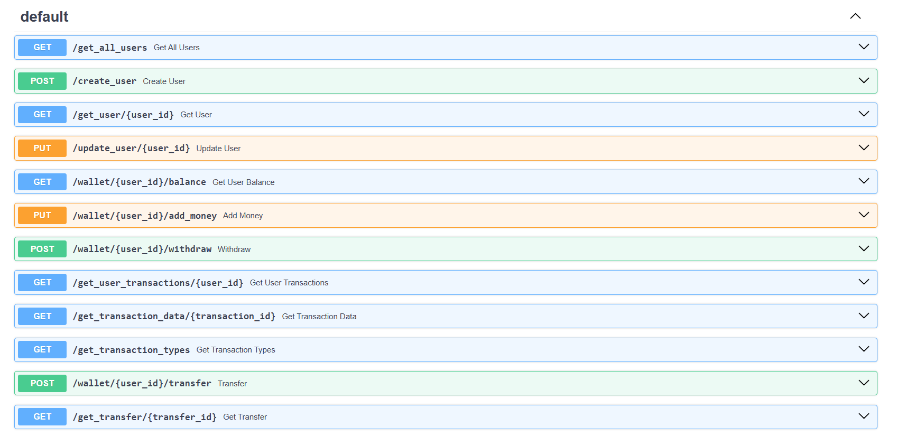

# A simple Backend for Transaction Management 

## To install  and Run

### Step 1 : Clone the Repo 
'''
git clone https://github.com/lokeshpanthangi/evaluation-2.git
'''

### Step 2 : Install the Dependensies
'''
pip install -r requirements.txt
'''

## Step 3 : Run the Project 
'''
uvicorn main:app --reload
'''

## In this project I used only FastAPI and SqlAlchemy a little Pydantic for schemas and Input Validation

### transaction.py - contains the API routes for the Transactions 
such as 1.Create 
        2.Delete
        3.Update
        4.Get all
        5.Get Particular Transaction

### user.py - contains the API routes for User Management 
such as 1.Create
        2.Update
        3.Get all
        4.Get Particualar User

### wallet.py - contains the API routes fot the Wallet Management 
such as 1.Add money
        2.Withdraw money
        3.Transfer money
        4.Check Balance

### If you perfrom any operation in the wallet it will uptomatically update the Transactions and we can Create our own Transaction as well